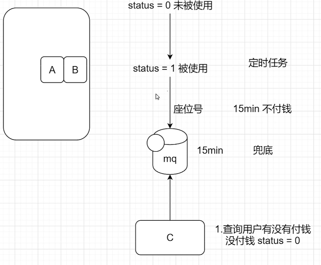

# mq消息模式

## 消费模式

push：队列有消息都投递给你，实时性很强，导致客户端压力过大
pull：消费者主动去mq拉去消息，压力可控，实时性不强

不管push还是pull模式，底层都是pull模式，push模式是客户端基于长轮询pull底层实现的

- push模式消费

```java
// 创建一个消费者
DefaultMQPushConsumer consumer = new DefaultMQPushConsumer("test-consumer-group");
// 设置nameserver地址
consumer.setNamesrvAddr(MqConstant.NAME_SRV_ADDR);
// 订阅一个主题 *标识订阅这个主题所有消息
consumer.subscribe("testTopic", "*");
// 创建一个监听器 （一直监听，异步回调方式）
consumer.registerMessageListener(new MessageListenerConcurrently(){
    @Override
    public ConsumeConcurrentlyStatus consumeMessage(List<MessageExt> msgs, ConsumeConcurrentlyContext context) {
        // 消费消息
        System.out.println("我是消费者");
        for (MessageExt msg : msgs) {
            System.out.println(msg.toString());
            System.out.println("消息内容:" + new String(msg.getBody()));
        }
        System.out.println("消费上下文:" + context);
        // 返回值
        return ConsumeConcurrentlyStatus.CONSUME_SUCCESS;
    }
});
// 启动
consumer.start();
```

## 发送同步消息

```java
// 创建一个生产者
DefaultMQProducer producer = new DefaultMQProducer("test-producer-group");
// 连接nameserver
producer.setNamesrvAddr(MqConstant.NAME_SRV_ADDR);
// 启动
producer.start();
// 创建消息
Message message = new Message("testTopic", "我是一个简单的消息".getBytes());
// 发送消息
SendResult sendResult = producer.send(message);
System.out.println(sendResult.getSendStatus());
// 关闭生产者
producer.shutdown();
```

## 发送异步消息

```java
DefaultMQProducer producer = new DefaultMQProducer("async-producer-group");
producer.setNamesrvAddr(MqConstant.NAME_SRV_ADDR);
producer.start();
Message message = new Message("asyncTopic",  "我是一个异步消息".getBytes());
producer.send(message, new SendCallback() {

    @Override
    public void onSuccess(SendResult sendResult) {
        System.out.println("发送成功");
    }

    @Override
    public void onException(Throwable e) {
        System.err.println("发送失败:" + e.getMessage());
    }
    
});
```

## 发送单向消息

- 用在不关心消息结果上, 如日志数据

```java
DefaultMQProducer producer = new DefaultMQProducer("oneway-producer-group");
producer.setNamesrvAddr(MqConstant.NAME_SRV_ADDR);
producer.start();
Message message = new Message("onewayTopic",  "日志xxx".getBytes());
producer.sendOneway(message);
System.out.println("成功");
producer.shutdown();
```

## 发送延迟消息

- 消息放入mg后，过一段时间，才会被监听到，然后消费比如下订单业务，提交了一个订单就可以发送一个延时消息，30min后去检查这个订单的状态，如果还是未付款就取消订单释放库存


```java
@Test
public void msProducer() throws Exception {
    DefaultMQProducer producer = new DefaultMQProducer("ms-producer-group");
    producer.setNamesrvAddr(MqConstant.NAME_SRV_ADDR);
    producer.start();
    Message message = new Message("orderMsTopic", "订单号，座位号".getBytes());
    // 给消息设置死亡时间 messageDelayLevel="1s 5s 10s 30s 1m 2m 3m 4m 5m 6m 7m 8m 9m 10m 20m
    // 30m 1h 2h"
    message.setDelayTimeLevel(3);
    producer.send(message);
    System.out.println("发送时间:" + new Date());
    producer.shutdown();
}

@Test
public void msConsumer() throws Exception {
    DefaultMQPushConsumer consumer = new DefaultMQPushConsumer("ms-consumer-group");
    consumer.setNamesrvAddr(MqConstant.NAME_SRV_ADDR);
    consumer.subscribe("orderMsTopic", "*");
    consumer.registerMessageListener(new MessageListenerConcurrently() {

        @Override
        public ConsumeConcurrentlyStatus consumeMessage(List<MessageExt> msgs, ConsumeConcurrentlyContext context) {
            System.out.println("收到消息了:" + new Date());
            for (MessageExt msg : msgs) {
                System.out.println(msg.toString());
                System.out.println("消息内容:" + new String(msg.getBody()));
            }
            System.out.println("消费上下文:" + context);
            return ConsumeConcurrentlyStatus.CONSUME_SUCCESS;
        }

    });
    consumer.start();
    System.in.read();
}
```

## 发送批量消息

```java
@Test
public void simpleBatchProducer() throws Exception {
    // 创建一个生产者
    DefaultMQProducer producer = new DefaultMQProducer("batch-producer-group");
    // 连接nameserver
    producer.setNamesrvAddr(MqConstant.NAME_SRV_ADDR);
    // 启动
    producer.start();
    // 创建消息
    List<Message> msgs = Arrays.asList(
        new Message("batchTopic", "我是一组消息的A消息".getBytes()),
        new Message("batchTopic", "我是一组消息的B消息".getBytes()),
        new Message("batchTopic", "我是一组消息的C消息".getBytes())
    );
    // 发送消息
    SendResult sendResult = producer.send(msgs);
    System.out.println(sendResult.getSendStatus());
    // 关闭生产者
    producer.shutdown();
}

@Test
public void simpleBatchConsumer() throws Exception {
    DefaultMQPushConsumer consumer = new DefaultMQPushConsumer("batch-consumer-group");
    consumer.setNamesrvAddr(MqConstant.NAME_SRV_ADDR);
    consumer.subscribe("batchTopic", "*");
    consumer.registerMessageListener(new MessageListenerConcurrently() {

        @Override
        public ConsumeConcurrentlyStatus consumeMessage(List<MessageExt> msgs, ConsumeConcurrentlyContext context) {
            System.out.println("收到消息了:" + new Date()+ " 消息个数:" + msgs.size());
            for (MessageExt msg : msgs) {
                System.out.println(msg.toString());
                System.out.println("消息内容:" + new String(msg.getBody()));
            }
            System.out.println("消费上下文:" + context);
            return ConsumeConcurrentlyStatus.CONSUME_SUCCESS;
        }

    });
    consumer.start();
    System.in.read();
}
```

## 发送顺序消息

**默认发送消息模式为`并发模式`
1. 接收消费者需改为`单线程模式`
2. 发送需要指定`消息队列`

```java
@Test
public void orderlyProducer() throws Exception{
    DefaultMQProducer producer = new DefaultMQProducer("orderly-producer-group");
    producer.setNamesrvAddr(MqConstant.NAME_SRV_ADDR);
    producer.start();
    // 发送顺序消息 发送时确保有序，并且要发送到同一个队列下面去
    msgModels.forEach(msgModel -> {
        Message message = new Message("orderlyTopic", msgModel.toString().getBytes());
        try {
            // 发相同的订单号去相同的队列
            producer.send(message, new MessageQueueSelector() {

                @Override
                public MessageQueue select(List<MessageQueue> mqs, Message msg, Object arg) {
                    int hashCode = msgModel.getOrderSn().hashCode();
                    int i = hashCode % mqs.size();
                    return mqs.get(i);
                }
                
            }, msgModel.getOrderSn());
        } catch (MQClientException | RemotingException | MQBrokerException | InterruptedException e) {
            // TODO Auto-generated catch block
            e.printStackTrace();
        }
    });

    producer.shutdown();
    System.out.println("发送完成");
}

@Test
public void orderlyConsumer() throws Exception {
    DefaultMQPushConsumer consumer = new DefaultMQPushConsumer("orderly-consumer-group");
    consumer.setNamesrvAddr(MqConstant.NAME_SRV_ADDR);
    consumer.subscribe("orderlyTopic", "*");
    // MessageListenerConcurrently 并发模式 多线程的 重试16次 失败会放入死信队列
    // MessageListenerOrderly 顺序模式 每一组是一个线程 无限重试 Integer.MAX_VALUE
    consumer.registerMessageListener(new MessageListenerOrderly() {

        @Override
        public ConsumeOrderlyStatus consumeMessage(List<MessageExt> msgs, ConsumeOrderlyContext context) {
            System.out.println("线程id:" + Thread.currentThread().getId());
            // System.out.println("收到消息了:" + new Date());
            for (MessageExt msg : msgs) {
                // System.out.println(msg.toString());
                System.out.println("消息内容:" + new String(msg.getBody()));
            }
            // System.out.println("消费上下文:" + context);
            return ConsumeOrderlyStatus.SUCCESS;
        }
        
    });
    consumer.start();
    System.in.read();
}
```

## 发送Tag消息

```java
@Test
public void tagProducer() throws Exception {
    DefaultMQProducer producer = new DefaultMQProducer("tag-producer-group");
    producer.setNamesrvAddr(MqConstant.NAME_SRV_ADDR);
    producer.start();

    Message message = new Message("tagTopic", "vip1", "我是vip1的文章".getBytes());
    Message message2 = new Message("tagTopic", "vip2", "我是vip2的文章".getBytes());
    producer.send(message);
    producer.send(message2);

    producer.shutdown();
    System.out.println("发送完成");
}

@Test
public void tagConsumer1() throws Exception {
    DefaultMQPushConsumer consumer = new DefaultMQPushConsumer("tag-consumer-group-a");
    consumer.setNamesrvAddr(MqConstant.NAME_SRV_ADDR);
    consumer.subscribe("tagTopic", "vip1");
    consumer.registerMessageListener(new MessageListenerConcurrently() {

        @Override
        public ConsumeConcurrentlyStatus consumeMessage(List<MessageExt> msgs, ConsumeConcurrentlyContext context) {
            for (MessageExt msg : msgs) {
                System.out.println("我是vip1消费者，消费消息:" + new String(msg.getBody()));
            }
            return ConsumeConcurrentlyStatus.CONSUME_SUCCESS;
        }

    });
    consumer.start();
    System.in.read();
}

@Test
public void tagConsumer2() throws Exception {
    DefaultMQPushConsumer consumer = new DefaultMQPushConsumer("tag-consumer-group-b");
    consumer.setNamesrvAddr(MqConstant.NAME_SRV_ADDR);
    consumer.subscribe("tagTopic", "vip1 || vip2");
    consumer.registerMessageListener(new MessageListenerConcurrently() {

        @Override
        public ConsumeConcurrentlyStatus consumeMessage(List<MessageExt> msgs, ConsumeConcurrentlyContext context) {
            for (MessageExt msg : msgs) {
                System.out.println("我是vip2消费者，消费消息:" + new String(msg.getBody()));
            }
            return ConsumeConcurrentlyStatus.CONSUME_SUCCESS;
        }

    });
    consumer.start();
    System.in.read();
}
```

- 什么时候该用Topic，什么时候该用Tag？
  可以从以下几个方面进行判断：
  1.消息类型是否一致：如普通消息、事务消息、定时（延时）消息、顺序消息，不同的消息类型使用不同的 Topic，无法通过 Tag 进行区分。
  2.业务是否相关联：没有直接关联的消息，如淘宝交易消息，京东物流消息使用不同的Topic进行区分;而同样是天猫交易消息，电器类订单、女装类订单、化妆品类订单的消息可以用Tag进行区分。
  3.消息优先级是否一致：如同样是物流消息，盒马必须小时内送达，天猫超市24小时内送达，淘宝物流则相对会慢一些，不同优先级的消息用不同的 Topic 进行区分。
  4.消息量级是否相当：有些业务消息虽然量小但是实时性要求高，如果跟某些万亿量级的消息使用同一个Topic，则有可能会因为过长的等待时间而“饿死”，此时需要将不同量级的消息进行拆分，使用不同的 Topic。

**总的来说，针对消息分类，您可以选择创建多个Topic，或者在同一个Topic下创建多个Tag。但通常情况下，不同的Topic 之间的消息没有必然的联系，而Tag则用来区分同一个Topic下相互关联的消息，例如全集和子集的关系、流程先后的关系。**