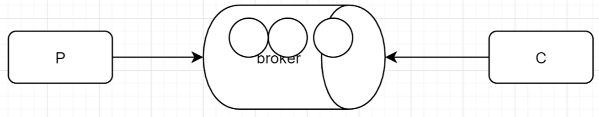
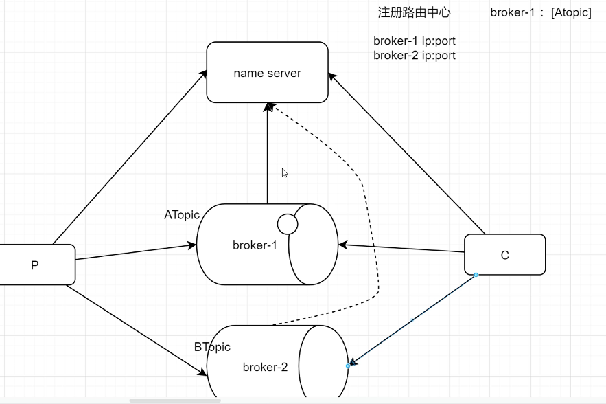
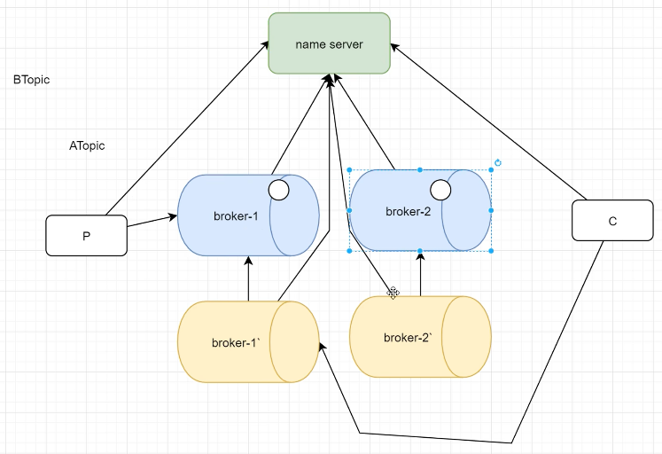

# rocketmq

activeMg:java写的(jms协议)，性能一般，出现早，功能单一，吞吐量低    万级
rabbitmq:erlang(amqp协议)，性能好，功能丰富，吞吐量一般            万级
rocketmq:java（阿里），性能好，功能最丰富，吞吐量高         10万级
kafka:scala写的，吞吐量最大，功能单一           10万级

## 为什么去用mq

削峰限流 异步 解耦合

## 集群方案

rocketmq 结构高可用的集群方案

生产者：我们的应用程序
消费者：手我们的应用，程序
broker：经理人主题
Topic：消息的区分，分类／虚拟的结构队列
Queue:真实存在的结构，消息的内容

### 普通方案（单机版）

### 写的高可用(负载均衡)

### 写读高可用

