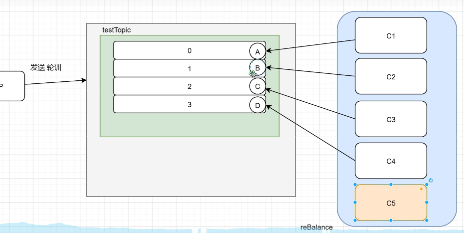

# 快速入门

## 消息生产者

1.创建消息生产者 producer，并制定生产者组名
2.指定Nameserver 地址
3.启动 producer
4.创建消息对象，指定主题Topic、Tag 和消息体等
5.发送消息
6.关闭生产者 producer

## 消息消费者

1.创建消费者consumer,制定消费者组名
2.指定 Nameserver 地址
3.创建监听订阅主题 Topic 和 Tag 等
4.处理消息
5.启动消费者consumer

## 消息消费

- 消费者组必须订阅关系一致

## 消费模式

### 负载均衡模式

- 队列必须大于等于消费者，否则多余的消费者不能消费到消息

### 广播消息

- 以组为单位，每个组一份消息