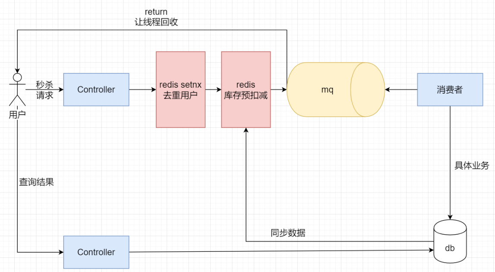

# 秒杀系统

## 分析

- 单tomcat节点 (1w/s)

- nginx (5w/s)
  - tomcat (1w/s)
  - ...

- Lvs/F5 (20w/s) 硬件
  - nginx (5w/s)
    - tomcat (1w/s)
    - ...
  - ...

- 域名/dns轮询策略 (100w/s)
  - Lvs/F5 (20w/s) 各个机房
    - nginx (5w/s)
      - tomcat (1w/s)
      - tomcat...
    - nginx...
  - Lvs/F5...

## 如何优化接口响应时间

1.能异步就异步
2.减少IO(统一查，统一写)
3.尽早return
4.加锁粒度尽可能小
5.事务控制粒度尽可能小
.....

## 秒杀设计

- 判断库存够不够如果够执行业务不够直接return
- redis 并发量
 - read 11w/-8w
 - write 8w-6w
- 消费券 
  - 1个人只能抢一次
  - 1个人针对一个商品只能抢一次
  
## 技术选择型

- Springboot +接收请求并操作redis和mysql
- Redis   用于缓存+分布式锁
- Rocketmq  用于解耦  削峰，异步
- Mysql   用于存放真实的商品信息
- Mybatis   用于操作数据库的orm框架

## 架构图

## 